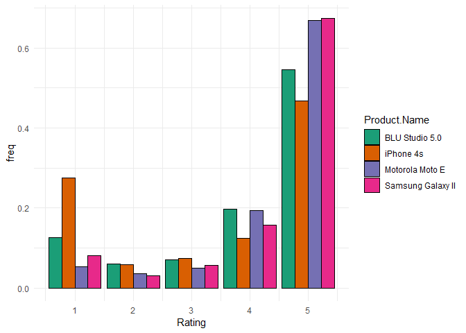
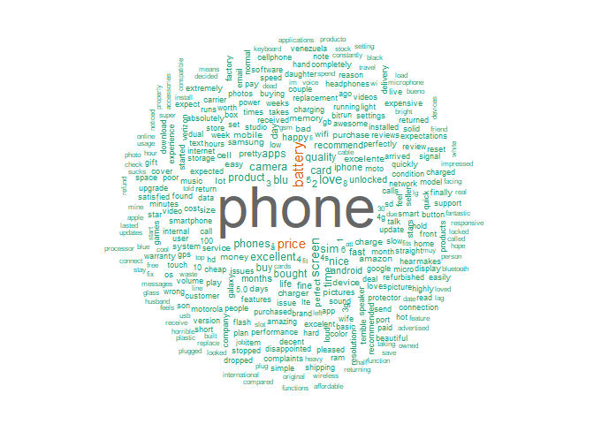
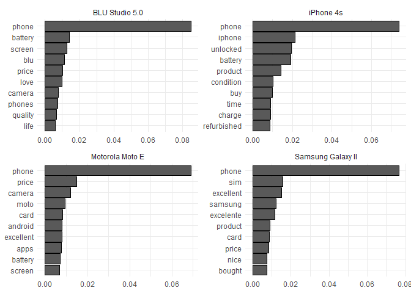
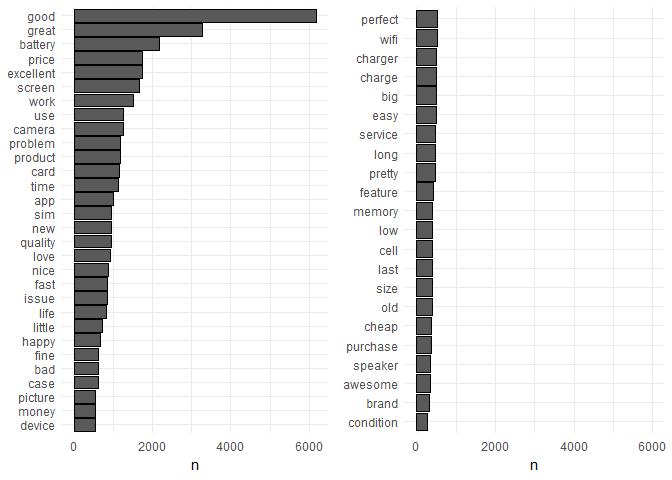
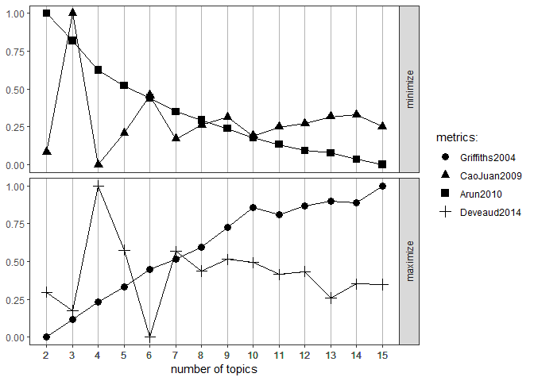
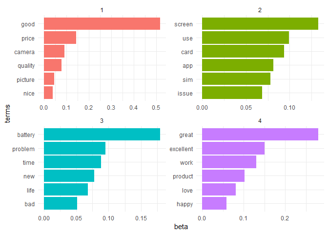
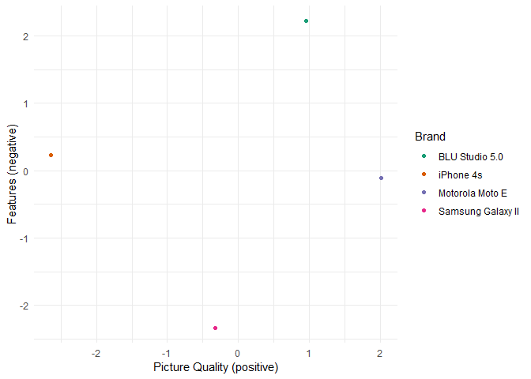
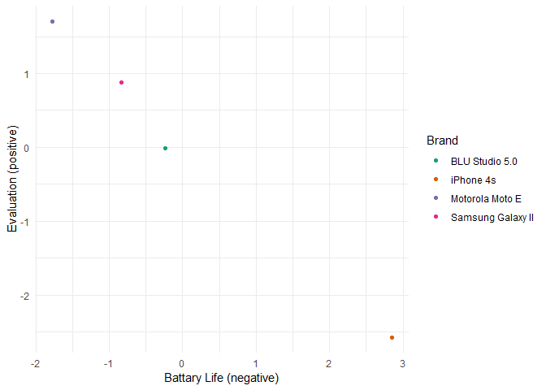


#### Packages

``` r
library(tidyverse)
library(tm)
library(tagger)
library(tidytext)
library(ldatuning)
library(topicmodels)
library(parallel)
library(parallelMap) 
library(textclean)
library(qdapRegex)
library(qdap)
library(textstem)
library(pluralize)
library(udpipe)
library(statip)
library(wordcloud)
library(gridExtra)
library(stringi)
library(drlib)
library(kableExtra)
library(knitr)
library(ggpubr)
library(RCurl)
```

1 Introduction
==============

In this notebook, the image dimensions of four mobile phones will be extracted out of customer reviews. Furthermore, mobile phones will be compared regarding the extracted dimensions. This application is based on customer reviews of unlocked mobile phones of the online retailer Amazon.com. The data can be downloaded under the following link: (<https://www.kaggle.com/nehasontakke/amazon-unlocked-mobilecsv>)

2 Data wrangling
================

**Reading data**

``` r
dat = read.csv("../LDA/Amazon_Unlocked_Mobile.csv", 
               encoding = "UTF-16LE", 
               stringsAsFactors = F)
```

**Overview**

``` r
glimpse(dat)  
```

    ## Observations: 413,840
    ## Variables: 6
    ## $ Product.Name <chr> "\"CLEAR CLEAN ESN\" Sprint EPIC 4G Galaxy SPH-D7...
    ## $ Brand.Name   <chr> "Samsung", "Samsung", "Samsung", "Samsung", "Sams...
    ## $ Price        <dbl> 199.99, 199.99, 199.99, 199.99, 199.99, 199.99, 1...
    ## $ Rating       <int> 5, 4, 5, 4, 4, 1, 2, 2, 5, 3, 3, 5, 5, 1, 5, 2, 5...
    ## $ Reviews      <chr> "I feel so LUCKY to have found this used (phone t...
    ## $ Review.Votes <int> 1, 0, 0, 0, 0, 1, 0, 0, 0, 0, 0, 0, 2, 1, 1, 0, 6...

**Subsetting the data**

The most common mobile phones for a given brand are the "Apple iPhone 4s", "BLU Studio 5.0", "Motorola Moto E" and the "Samsung Galaxy S Duos II".

``` r
dat %>%
  group_by(Product.Name) %>%
  count() %>%
  arrange(-n) %>%
  head(8) %>%
  kable("html") 
```

<table>
<thead>
<tr>
<th style="text-align:left;">
Product.Name
</th>
<th style="text-align:right;">
n
</th>
</tr>
</thead>
<tbody>
<tr>
<td style="text-align:left;">
Apple iPhone 4s 8GB Unlocked Smartphone w/ 8MP Camera, White (Certified Refurbished)
</td>
<td style="text-align:right;">
1451
</td>
</tr>
<tr>
<td style="text-align:left;">
Apple MF259LL/A - iPhone 4s 8GB / 8MP Camera - Unlocked - Black (Certified Refurbished)
</td>
<td style="text-align:right;">
1241
</td>
</tr>
<tr>
<td style="text-align:left;">
BLU Studio 5.0 C HD Unlocked Cellphone, Black
</td>
<td style="text-align:right;">
1194
</td>
</tr>
<tr>
<td style="text-align:left;">
OtterBox Iphone 5/5S/SE Defender Case w/ Drop and Dust Proctection - Realtree AP Pink
</td>
<td style="text-align:right;">
1129
</td>
</tr>
<tr>
<td style="text-align:left;">
Motorola Moto E (1st Generation) - Black - 4 GB - Global GSM Unlocked Phone
</td>
<td style="text-align:right;">
1127
</td>
</tr>
<tr>
<td style="text-align:left;">
Apple iPhone 5s 32GB (Silver) - AT&T
</td>
<td style="text-align:right;">
1118
</td>
</tr>
<tr>
<td style="text-align:left;">
BLU Energy X Plus Smartphone - With 4000 mAh Super Battery- US GSM Unlocked - Grey
</td>
<td style="text-align:right;">
1111
</td>
</tr>
<tr>
<td style="text-align:left;">
Samsung Galaxy S Duos II S7582 DUAL SIM Factory Unlocked International Version - Black
</td>
<td style="text-align:right;">
1109
</td>
</tr>
</tbody>
</table>

**Filtering the most common smartphones**

For the upcoming analyses, these four mobile phones will be used. So, all reviews will be filtered which refer to those four phones.

``` r
patterns =  c("iPhone 4s 8GB", "Samsung Galaxy S Duos II", "BLU Studio 5.0 ", "Motorola Moto E")

datsub = dat %>% 
  filter(grepl(paste(patterns, collapse="|"), Product.Name))
```

**Renaming product names**

As you can see, the models named slightly different (e.g. because of the color).

``` r
datsub %>%
  select(Product.Name) %>%
  distinct() %>%
  head(10) %>%
  kable("html") 
```

<table>
<thead>
<tr>
<th style="text-align:left;">
Product.Name
</th>
</tr>
</thead>
<tbody>
<tr>
<td style="text-align:left;">
Apple iPhone 4s 8GB Unlocked GSM Smartphone w/ Siri, iCloud and 8MP Camera - Black
</td>
</tr>
<tr>
<td style="text-align:left;">
Apple iPhone 4s 8GB Unlocked Smartphone w/ 8MP Camera, White (Certified Refurbished)
</td>
</tr>
<tr>
<td style="text-align:left;">
Apple MF259LL/A - iPhone 4s 8GB / 8MP Camera - Unlocked - Black (Certified Refurbished)
</td>
</tr>
<tr>
<td style="text-align:left;">
BLU Studio 5.0 C HD - Unlocked Cell Phones - Retail Packaging - Blue
</td>
</tr>
<tr>
<td style="text-align:left;">
BLU Studio 5.0 C HD Quad Core - Unlocked Cell Phone - (Pink)
</td>
</tr>
<tr>
<td style="text-align:left;">
BLU Studio 5.0 C HD Quad Core - Unlocked Cell Phone - (Yellow)
</td>
</tr>
<tr>
<td style="text-align:left;">
BLU Studio 5.0 C HD Smartphone - Unlocked - Orange
</td>
</tr>
<tr>
<td style="text-align:left;">
BLU Studio 5.0 C HD Smartphone - Unlocked - Yellow
</td>
</tr>
<tr>
<td style="text-align:left;">
BLU Studio 5.0 C HD Unlocked Cellphone, Black
</td>
</tr>
<tr>
<td style="text-align:left;">
BLU Studio 5.0 C HD Unlocked Cellphone, White
</td>
</tr>
</tbody>
</table>
Therefore, the names will be standardized.

``` r
datsub = datsub %>%
   mutate_at(vars(Product.Name),
            funs(replace(., grepl('iPhone', .), 'iPhone 4s'))) %>%
  mutate_at(vars(Product.Name),  
            funs(replace(., grepl('BLU', .), 'BLU Studio 5.0'))) %>%
  mutate_at(vars(Product.Name),
            funs(replace(., grepl('Samsung', .), 'Samsung Galaxy II'))) %>%
  mutate_at(vars(Product.Name),
            funs(replace(., grepl('Motorola', .), 'Motorola Moto E')))
```

3 EDA
=====

3.1 Products
------------

**Amount of products**

The most common smartphone is the "BLU Studio 5.0" while the other phones occur less frequent.

``` r
datsub %>%
  group_by(Product.Name) %>%
  summarise(n = n()) %>%
  kable("html") 
```

<table>
<thead>
<tr>
<th style="text-align:left;">
Product.Name
</th>
<th style="text-align:right;">
n
</th>
</tr>
</thead>
<tbody>
<tr>
<td style="text-align:left;">
BLU Studio 5.0
</td>
<td style="text-align:right;">
6718
</td>
</tr>
<tr>
<td style="text-align:left;">
iPhone 4s
</td>
<td style="text-align:right;">
2939
</td>
</tr>
<tr>
<td style="text-align:left;">
Motorola Moto E
</td>
<td style="text-align:right;">
2234
</td>
</tr>
<tr>
<td style="text-align:left;">
Samsung Galaxy II
</td>
<td style="text-align:right;">
2217
</td>
</tr>
</tbody>
</table>

**Rating of the products**

The Motorola Phone has the best rating of all smartphones where the iPhone has the least good rating.

``` r
datsub %>%
  group_by(Product.Name) %>%
  summarise(Rating_mean = mean(Rating),
            Rating_sd = sd(Rating)) %>%
  kable("html") 
```

<table>
<thead>
<tr>
<th style="text-align:left;">
Product.Name
</th>
<th style="text-align:right;">
Rating\_mean
</th>
<th style="text-align:right;">
Rating\_sd
</th>
</tr>
</thead>
<tbody>
<tr>
<td style="text-align:left;">
BLU Studio 5.0
</td>
<td style="text-align:right;">
3.976779
</td>
<td style="text-align:right;">
1.411705
</td>
</tr>
<tr>
<td style="text-align:left;">
iPhone 4s
</td>
<td style="text-align:right;">
3.451174
</td>
<td style="text-align:right;">
1.718611
</td>
</tr>
<tr>
<td style="text-align:left;">
Motorola Moto E
</td>
<td style="text-align:right;">
4.390331
</td>
<td style="text-align:right;">
1.087656
</td>
</tr>
<tr>
<td style="text-align:left;">
Samsung Galaxy II
</td>
<td style="text-align:right;">
4.310329
</td>
<td style="text-align:right;">
1.220776
</td>
</tr>
</tbody>
</table>
Most smartphones have a 5-star rating. All other ratings occur less frequent.

``` r
datsub %>%
  select(Product.Name, Rating) %>%
  group_by(Product.Name, Rating) %>%
  summarise(n = n()) %>%
  mutate(freq = n /sum(n)) %>%
  ggplot(aes(x = Rating, y = freq, fill = Product.Name)) +
  geom_bar(stat = "identity", position = "dodge", col = "black") +
  scale_fill_brewer(palette="Dark2") +
  theme_minimal()
```



3.2 Reviews
-----------

**Distribution of words**

Let´s take a look at the distribution of the words within the data. Most words are extremely sparse.

``` r
datsub %>%
  unnest_tokens(word, Reviews) %>%
  anti_join(stop_words, by = "word") %>%
  group_by(word) %>%
  summarise(n = n()) %>%
  arrange(-n) %>%
  with(wordcloud(word, n, 
                 min.freq = 3, 
                 max.words = 350, 
                 random.order = FALSE, 
                 colors = brewer.pal(8,"Dark2")))
```



**Terms per product**

As you can see, the frequency of the most common words per smartphone is different. This indicates that the phones are perceived differently by the customers since we are dealing with product reviews.

``` r
datsub %>%
  unnest_tokens(word, Reviews) %>%
  anti_join(stop_words, by = "word") %>%
  group_by(Product.Name, word) %>%
  summarise(n = n()) %>%
  mutate(freq = n/sum(n)) %>%
  group_by(Product.Name) %>%
  top_n(10, freq) %>%
  ggplot(aes(reorder_within(word, freq, Product.Name), freq)) +
  geom_bar(stat = "identity", col = "black") +
  scale_x_reordered() +
  facet_wrap(~Product.Name, drop = TRUE, scales = "free") +
  coord_flip() +
  theme_minimal() +
  labs(x = NULL, y = NULL)
```



3 Preprocessing
===============

Now, the reviews will be cleaned. The goal is to keep only those words which are useful to describe the properties of a smartphone i.e. the image of the phones. Following preprocessing steps will be done:

-   Basic cleaning (removing contractions, kerning, slang, word elongation)
-   Removing non-English characters and words (numbers, punctuations, non-words)
-   POS-Tagging of Nouns, Adjectives, Adverbs
-   Removing stopwords
-   Converting terms to lower case
-   Lemmatizing
-   Removing sparse terms (2%)
-   Removing useless terms

``` r
datsub$Reviews[1:5]
```

    ## [1] "It was new and at a great price! Phone came really quick...loved it and great Seller."                           
    ## [2] "If I could give this no stars I would but do not buy this product he is false advertising and the product sucks!"
    ## [3] "Is good, but it don`t have headphones. Thank you. Gloria Sànchez Q"                                             
    ## [4] "excelent phone! not problem"                                                                                     
    ## [5] "This phone IS unlocked. The \"Top reviews\" are misleading."

**Basic cleaning**

``` r
datsub$Reviews = replace_contraction(datsub$Reviews)
datsub$Reviews = replace_kern(datsub$Reviews)
datsub$Reviews = replace_internet_slang(datsub$Reviews)
datsub$Reviews = replace_word_elongation(datsub$Reviews)


datsub$Reviews[1:5]
```

    ## [1] "It was new and at a great price! Phone came really quick...loved it and great Seller."                           
    ## [2] "If I could give this no stars I would but do not buy this product he is false advertising and the product sucks!"
    ## [3] "Is good, but it don`t have headphones. Thank you. Gloria SÃ nchez Q"                                             
    ## [4] "Excelent phone! not problem"                                                                                     
    ## [5] "This phone IS unlocked. The Top reviews are misleading."

**Removing puctuation and numbers**

``` r
datsub$Reviews = replace_incomplete(datsub$Reviews, replacement = " ")

datsub$Reviews = gsub("[[:punct:]]+|[[:digit:]]+","", datsub$Reviews)


datsub$Reviews[1:5]
```

    ## [1] "It was new and at a great price Phone came really quick loved it and great Seller"                              
    ## [2] "If I could give this no stars I would but do not buy this product he is false advertising and the product sucks"
    ## [3] "Is good but it dont have headphones Thank you Gloria SÃ nchez Q"                                                
    ## [4] "Excelent phone not problem"                                                                                     
    ## [5] "This phone IS unlocked The Top reviews are misleading"

**Lower casing**

``` r
datsub$Reviews = tolower(datsub$Reviews)

datsub$Reviews[1:5]
```

    ## [1] "it was new and at a great price phone came really quick loved it and great seller"                              
    ## [2] "if i could give this no stars i would but do not buy this product he is false advertising and the product sucks"
    ## [3] "is good but it dont have headphones thank you gloria sã nchez q"                                                
    ## [4] "excelent phone not problem"                                                                                     
    ## [5] "this phone is unlocked the top reviews are misleading"

**Removing stopwords**

``` r
datsub$Reviews = removeWords(datsub$Reviews, stopwords("en"))

datsub$Reviews[1:5]
```

    ## [1] "  new    great price phone came really quick loved   great seller"    
    ## [2] "   give   stars      buy  product   false advertising   product sucks"
    ## [3] " good   dont  headphones thank  gloria sã nchez q"                    
    ## [4] "excelent phone  problem"                                              
    ## [5] " phone  unlocked  top reviews  misleading"

**Removing non-words**

``` r
datsub$Reviews = rm_nchar_words(datsub$Reviews, "1,2")
datsub$Reviews = replace_non_ascii(datsub$Reviews, "")

datsub$Reviews[1:5]
```

    ## [1] "new great price phone came really quick loved great seller"
    ## [2] "give stars buy product false advertising product sucks"    
    ## [3] "good dont headphones thank gloria nchez"                   
    ## [4] "excelent phone problem"                                    
    ## [5] "phone unlocked top reviews misleading"

**POS-Tagging**

``` r
parallelStartSocket(cpus = detectCores())

datsub$Reviews = tag_pos(datsub$Reviews) 

datsub$Reviews = select_tags(datsub$Reviews, (c("NN", "NNS", "RB", "RBS", "RBR", "JJ", "JJR", "JJS")))

datsub$Reviews = as_word_tag(datsub$Reviews)

datsub$Reviews = gsub("(/NN|/NNS|/RB|/RBS|/RBR|/JJ|/JJR|/JJS)","", datsub$Reviews)

parallelStop()

datsub$Reviews[1:5]
```

    ## [1] "new great price phone really quick great seller"
    ## [2] "stars product false advertising product sucks"  
    ## [3] "good dont headphones gloria"                    
    ## [4] "excelent phone problem"                         
    ## [5] "phone top reviews"

**Lemmatizing**

``` r
datsub$Reviews = lemmatize_strings(datsub$Reviews)
datsub$Reviews = stripWhitespace(datsub$Reviews)

datsub$Reviews[1:5]
```

    ## [1] "new great price phone really quick great seller"
    ## [2] "star product false advertise product suck"      
    ## [3] "good do headphone gloria"                       
    ## [4] "excelent phone problem"                         
    ## [5] "phone top review"

**Removing sparse terms**

``` r
corpus = Corpus(VectorSource(datsub$Reviews)) 

dtm = DocumentTermMatrix(corpus)

dtm = removeSparseTerms(dtm, 0.98)
```

**Removing useless terms**

``` r
tidy_dtm = tidy(dtm)

useless_terms = c("phone", "just", "really", "day", "month", "even", "blu", "now", "also", "everything", "far", "back", "first", "much", "thing", "iphone", "still", "samsung", "lot", "week", "year", "call", "never", "hour", "many", "way", "star", "enough", "able", "review", "buy", "need")

tidy_dtm = tidy_dtm %>%
  filter(!term %in% useless_terms)

tidy_dtm = tidy_dtm %>%
  mutate(term = ifelse(grepl("excel", term), "excellent", term))

dtm_clean = tidy_dtm %>% 
  cast_dtm(document, term, count)
```

The final dictionary looks like this

``` r
t1 = tidy_dtm %>%
  group_by(term) %>%
  summarise(n = sum(count)) %>%
  arrange(-n) %>%
  slice(1:30) %>%
  mutate(term = reorder(term, n)) %>%
  ggplot(aes(term, n)) +
  geom_bar(stat = "identity", col = "black") +
  coord_flip() +
  theme_minimal() +
  labs(x = NULL)

t2 = tidy_dtm %>%
  group_by(term) %>%
  summarise(n = sum(count)) %>%
  arrange(-n) %>%
  slice(31:nrow(.)) %>%
  mutate(term = reorder(term, n)) %>%
  ggplot(aes(term, n)) +
  geom_bar(stat = "identity", col = "black") +
  coord_flip() +
  ylim(0, 6000) +
  theme_minimal() +
  labs(x = NULL)

ggarrange(t1, t2)
```



4 Model building
================

To extract the image dimensions an LDA (Latent Dirichlet Allocation) will be used. An LDA can be considered as content analyses. It is supposed that every document, is a mixture of topics. Each topic is the probability distribution of all terms in a corpus. The probability that a term belongs to a certain topic is different. So, a topic will be formed out of the terms which occur together. However, one word can belong to more than one topic (e.g. the word "small" can refer to the size of the screen or the battery life of a phone). Since the corpus is built out of customer reviews it can be assumed, that the topics refer to the properties of the smartphones.

**Tuning the LDA**

Since the number of topics of an LDA is unknown beforehand, they have to be estimated.

``` r
rowTotals = apply(dtm_clean , 1, sum) 

dtm_clean = dtm_clean[rowTotals> 0, ] 

result = FindTopicsNumber(dtm_clean,
                          topics = seq(from = 2, to = 15, by = 1),
                          metrics = c("Griffiths2004", "CaoJuan2009", "Arun2010", "Deveaud2014"),
                          method = "Gibbs",
                          control = list(seed = 1),
                          mc.cores = 4L,
                          verbose = TRUE)
```

    ## fit models... done.
    ## calculate metrics:
    ##   Griffiths2004... done.
    ##   CaoJuan2009... done.
    ##   Arun2010... done.
    ##   Deveaud2014... done.

Based on the tuning results four topics can be assumed.

``` r
FindTopicsNumber_plot(result)
```



**Appling the model**

Now, the model will be fitted using four dimensions.

``` r
ap_lda = LDA(dtm_clean, 
         method = "Gibbs", 
         k = 4, 
         control = list(seed = 1))
```

**Plotting the dimensions**

Let´s take a look at the dimensions. Regarding the terms of each topic the identified dimensions could be named as follows:

-   Dimension 1: "Picture quality" (positive, because positive terms are associated with the dimension)
-   Dimension 2: "Features" (negative, because positive terms are associated with the dimension)
-   Dimension 3: "Battery life" (negative, because positive terms are associated with the dimension)
-   Dimension 4: "Evaluation" (positive, because positive terms are associated with the dimension)

``` r
ap_topics = tidy(ap_lda, matrix = "beta")

ap_top_terms = ap_topics %>%
  group_by(topic) %>%
  top_n(6, beta) %>%
  arrange(topic, -beta)


ap_top_terms %>%
  ggplot(aes(reorder(term, beta), beta, fill = factor(topic))) +
  geom_col(show.legend = FALSE) +
  facet_wrap(~ topic, scales = "free") +
  labs(x = "terms") +
  coord_flip() +
  theme_minimal()
```



5 Mapping the brands
====================

Finally, the four brands will be compared regarding the dimensions/topics. This will be done by an MDS (multidimensional scaling). In order to find the position of the brands, the distance between the brands will be measured on a given dimension. The distance will be estimated as the distributional similarity between the vector of words underlying the dimensions.

**Creating the word vectors**

First, the relative frequency of all terms will be calculated in order to get the distribution of the terms for each smartphone.

``` r
dtmSparse = as.data.frame(as.matrix(dtm))

dtmSparse = dtmSparse %>% 
  select(-one_of(useless_terms))

dtmSparse$Brand = datsub$Product.Name

dtmSparse = dtmSparse %>%
  group_by(Brand) %>%
  summarise_all(., funs(sum))

dtmSparse[-1] = dtmSparse[-1]/rowSums(dtmSparse[-1])

dtmSparse$excellent = dtmSparse$excellent + dtmSparse$excelente

dtmSparse = dtmSparse %>%
  select(-excelente)


kable(dtmSparse, "html")
```

<table>
<thead>
<tr>
<th style="text-align:left;">
Brand
</th>
<th style="text-align:right;">
great
</th>
<th style="text-align:right;">
new
</th>
<th style="text-align:right;">
price
</th>
<th style="text-align:right;">
product
</th>
<th style="text-align:right;">
good
</th>
<th style="text-align:right;">
problem
</th>
<th style="text-align:right;">
battery
</th>
<th style="text-align:right;">
condition
</th>
<th style="text-align:right;">
time
</th>
<th style="text-align:right;">
card
</th>
<th style="text-align:right;">
fast
</th>
<th style="text-align:right;">
sim
</th>
<th style="text-align:right;">
brand
</th>
<th style="text-align:right;">
excellent
</th>
<th style="text-align:right;">
happy
</th>
<th style="text-align:right;">
purchase
</th>
<th style="text-align:right;">
money
</th>
<th style="text-align:right;">
love
</th>
<th style="text-align:right;">
bad
</th>
<th style="text-align:right;">
charge
</th>
<th style="text-align:right;">
fine
</th>
<th style="text-align:right;">
old
</th>
<th style="text-align:right;">
work
</th>
<th style="text-align:right;">
use
</th>
<th style="text-align:right;">
app
</th>
<th style="text-align:right;">
little
</th>
<th style="text-align:right;">
nice
</th>
<th style="text-align:right;">
screen
</th>
<th style="text-align:right;">
awesome
</th>
<th style="text-align:right;">
perfect
</th>
<th style="text-align:right;">
service
</th>
<th style="text-align:right;">
memory
</th>
<th style="text-align:right;">
cheap
</th>
<th style="text-align:right;">
cell
</th>
<th style="text-align:right;">
camera
</th>
<th style="text-align:right;">
easy
</th>
<th style="text-align:right;">
life
</th>
<th style="text-align:right;">
charger
</th>
<th style="text-align:right;">
size
</th>
<th style="text-align:right;">
case
</th>
<th style="text-align:right;">
device
</th>
<th style="text-align:right;">
quality
</th>
<th style="text-align:right;">
issue
</th>
<th style="text-align:right;">
pretty
</th>
<th style="text-align:right;">
last
</th>
<th style="text-align:right;">
long
</th>
<th style="text-align:right;">
wifi
</th>
<th style="text-align:right;">
low
</th>
<th style="text-align:right;">
picture
</th>
<th style="text-align:right;">
big
</th>
<th style="text-align:right;">
speaker
</th>
<th style="text-align:right;">
feature
</th>
</tr>
</thead>
<tbody>
<tr>
<td style="text-align:left;">
BLU Studio 5.0
</td>
<td style="text-align:right;">
0.0693521
</td>
<td style="text-align:right;">
0.0146060
</td>
<td style="text-align:right;">
0.0381949
</td>
<td style="text-align:right;">
0.0195926
</td>
<td style="text-align:right;">
0.1199958
</td>
<td style="text-align:right;">
0.0263121
</td>
<td style="text-align:right;">
0.0511034
</td>
<td style="text-align:right;">
0.0012732
</td>
<td style="text-align:right;">
0.0228109
</td>
<td style="text-align:right;">
0.0195572
</td>
<td style="text-align:right;">
0.0206536
</td>
<td style="text-align:right;">
0.0158438
</td>
<td style="text-align:right;">
0.0066841
</td>
<td style="text-align:right;">
0.0270901
</td>
<td style="text-align:right;">
0.0143231
</td>
<td style="text-align:right;">
0.0076744
</td>
<td style="text-align:right;">
0.0118829
</td>
<td style="text-align:right;">
0.0238718
</td>
<td style="text-align:right;">
0.0117414
</td>
<td style="text-align:right;">
0.0090890
</td>
<td style="text-align:right;">
0.0117414
</td>
<td style="text-align:right;">
0.0074975
</td>
<td style="text-align:right;">
0.0277974
</td>
<td style="text-align:right;">
0.0241194
</td>
<td style="text-align:right;">
0.0230584
</td>
<td style="text-align:right;">
0.0146768
</td>
<td style="text-align:right;">
0.0175060
</td>
<td style="text-align:right;">
0.0453388
</td>
<td style="text-align:right;">
0.0094073
</td>
<td style="text-align:right;">
0.0063658
</td>
<td style="text-align:right;">
0.0117414
</td>
<td style="text-align:right;">
0.0074975
</td>
<td style="text-align:right;">
0.0069670
</td>
<td style="text-align:right;">
0.0088061
</td>
<td style="text-align:right;">
0.0283279
</td>
<td style="text-align:right;">
0.0106804
</td>
<td style="text-align:right;">
0.0218206
</td>
<td style="text-align:right;">
0.0078158
</td>
<td style="text-align:right;">
0.0087000
</td>
<td style="text-align:right;">
0.0180011
</td>
<td style="text-align:right;">
0.0129085
</td>
<td style="text-align:right;">
0.0238718
</td>
<td style="text-align:right;">
0.0209011
</td>
<td style="text-align:right;">
0.0115292
</td>
<td style="text-align:right;">
0.0094073
</td>
<td style="text-align:right;">
0.0098670
</td>
<td style="text-align:right;">
0.0100085
</td>
<td style="text-align:right;">
0.0082402
</td>
<td style="text-align:right;">
0.0138987
</td>
<td style="text-align:right;">
0.0122719
</td>
<td style="text-align:right;">
0.0091951
</td>
<td style="text-align:right;">
0.0083817
</td>
</tr>
<tr>
<td style="text-align:left;">
iPhone 4s
</td>
<td style="text-align:right;">
0.0716628
</td>
<td style="text-align:right;">
0.0551132
</td>
<td style="text-align:right;">
0.0113973
</td>
<td style="text-align:right;">
0.0474629
</td>
<td style="text-align:right;">
0.1108509
</td>
<td style="text-align:right;">
0.0288837
</td>
<td style="text-align:right;">
0.0616706
</td>
<td style="text-align:right;">
0.0343482
</td>
<td style="text-align:right;">
0.0323185
</td>
<td style="text-align:right;">
0.0227947
</td>
<td style="text-align:right;">
0.0101483
</td>
<td style="text-align:right;">
0.0224824
</td>
<td style="text-align:right;">
0.0170180
</td>
<td style="text-align:right;">
0.0251366
</td>
<td style="text-align:right;">
0.0188915
</td>
<td style="text-align:right;">
0.0129586
</td>
<td style="text-align:right;">
0.0123341
</td>
<td style="text-align:right;">
0.0142077
</td>
<td style="text-align:right;">
0.0218579
</td>
<td style="text-align:right;">
0.0263856
</td>
<td style="text-align:right;">
0.0173302
</td>
<td style="text-align:right;">
0.0129586
</td>
<td style="text-align:right;">
0.0618267
</td>
<td style="text-align:right;">
0.0212334
</td>
<td style="text-align:right;">
0.0081187
</td>
<td style="text-align:right;">
0.0112412
</td>
<td style="text-align:right;">
0.0149883
</td>
<td style="text-align:right;">
0.0110851
</td>
<td style="text-align:right;">
0.0040593
</td>
<td style="text-align:right;">
0.0201405
</td>
<td style="text-align:right;">
0.0110851
</td>
<td style="text-align:right;">
0.0015613
</td>
<td style="text-align:right;">
0.0065574
</td>
<td style="text-align:right;">
0.0064012
</td>
<td style="text-align:right;">
0.0020297
</td>
<td style="text-align:right;">
0.0039032
</td>
<td style="text-align:right;">
0.0099922
</td>
<td style="text-align:right;">
0.0257611
</td>
<td style="text-align:right;">
0.0010929
</td>
<td style="text-align:right;">
0.0043716
</td>
<td style="text-align:right;">
0.0074941
</td>
<td style="text-align:right;">
0.0067135
</td>
<td style="text-align:right;">
0.0135831
</td>
<td style="text-align:right;">
0.0039032
</td>
<td style="text-align:right;">
0.0078064
</td>
<td style="text-align:right;">
0.0121780
</td>
<td style="text-align:right;">
0.0184231
</td>
<td style="text-align:right;">
0.0039032
</td>
<td style="text-align:right;">
0.0021858
</td>
<td style="text-align:right;">
0.0034348
</td>
<td style="text-align:right;">
0.0054645
</td>
<td style="text-align:right;">
0.0012490
</td>
</tr>
<tr>
<td style="text-align:left;">
Motorola Moto E
</td>
<td style="text-align:right;">
0.0620447
</td>
<td style="text-align:right;">
0.0144536
</td>
<td style="text-align:right;">
0.0544066
</td>
<td style="text-align:right;">
0.0177438
</td>
<td style="text-align:right;">
0.1553467
</td>
<td style="text-align:right;">
0.0166863
</td>
<td style="text-align:right;">
0.0276146
</td>
<td style="text-align:right;">
0.0010576
</td>
<td style="text-align:right;">
0.0183314
</td>
<td style="text-align:right;">
0.0337250
</td>
<td style="text-align:right;">
0.0188014
</td>
<td style="text-align:right;">
0.0169213
</td>
<td style="text-align:right;">
0.0017626
</td>
<td style="text-align:right;">
0.0421857
</td>
<td style="text-align:right;">
0.0121034
</td>
<td style="text-align:right;">
0.0069330
</td>
<td style="text-align:right;">
0.0124559
</td>
<td style="text-align:right;">
0.0085781
</td>
<td style="text-align:right;">
0.0121034
</td>
<td style="text-align:right;">
0.0063455
</td>
<td style="text-align:right;">
0.0111633
</td>
<td style="text-align:right;">
0.0077556
</td>
<td style="text-align:right;">
0.0178613
</td>
<td style="text-align:right;">
0.0327850
</td>
<td style="text-align:right;">
0.0251469
</td>
<td style="text-align:right;">
0.0215041
</td>
<td style="text-align:right;">
0.0182139
</td>
<td style="text-align:right;">
0.0272620
</td>
<td style="text-align:right;">
0.0049354
</td>
<td style="text-align:right;">
0.0133960
</td>
<td style="text-align:right;">
0.0059929
</td>
<td style="text-align:right;">
0.0158637
</td>
<td style="text-align:right;">
0.0151586
</td>
<td style="text-align:right;">
0.0061105
</td>
<td style="text-align:right;">
0.0437133
</td>
<td style="text-align:right;">
0.0139835
</td>
<td style="text-align:right;">
0.0151586
</td>
<td style="text-align:right;">
0.0054054
</td>
<td style="text-align:right;">
0.0103408
</td>
<td style="text-align:right;">
0.0057579
</td>
<td style="text-align:right;">
0.0128085
</td>
<td style="text-align:right;">
0.0202115
</td>
<td style="text-align:right;">
0.0158637
</td>
<td style="text-align:right;">
0.0113984
</td>
<td style="text-align:right;">
0.0064630
</td>
<td style="text-align:right;">
0.0095182
</td>
<td style="text-align:right;">
0.0095182
</td>
<td style="text-align:right;">
0.0139835
</td>
<td style="text-align:right;">
0.0130435
</td>
<td style="text-align:right;">
0.0109283
</td>
<td style="text-align:right;">
0.0059929
</td>
<td style="text-align:right;">
0.0131610
</td>
</tr>
<tr>
<td style="text-align:left;">
Samsung Galaxy II
</td>
<td style="text-align:right;">
0.0644638
</td>
<td style="text-align:right;">
0.0123657
</td>
<td style="text-align:right;">
0.0281776
</td>
<td style="text-align:right;">
0.0352727
</td>
<td style="text-align:right;">
0.1544699
</td>
<td style="text-align:right;">
0.0235151
</td>
<td style="text-align:right;">
0.0233124
</td>
<td style="text-align:right;">
0.0042570
</td>
<td style="text-align:right;">
0.0267586
</td>
<td style="text-align:right;">
0.0370971
</td>
<td style="text-align:right;">
0.0115548
</td>
<td style="text-align:right;">
0.0472329
</td>
<td style="text-align:right;">
0.0034462
</td>
<td style="text-align:right;">
0.0914251
</td>
<td style="text-align:right;">
0.0107440
</td>
<td style="text-align:right;">
0.0046625
</td>
<td style="text-align:right;">
0.0052706
</td>
<td style="text-align:right;">
0.0208798
</td>
<td style="text-align:right;">
0.0093250
</td>
<td style="text-align:right;">
0.0040543
</td>
<td style="text-align:right;">
0.0178390
</td>
<td style="text-align:right;">
0.0066896
</td>
<td style="text-align:right;">
0.0395297
</td>
<td style="text-align:right;">
0.0330428
</td>
<td style="text-align:right;">
0.0196635
</td>
<td style="text-align:right;">
0.0115548
</td>
<td style="text-align:right;">
0.0257450
</td>
<td style="text-align:right;">
0.0158119
</td>
<td style="text-align:right;">
0.0022299
</td>
<td style="text-align:right;">
0.0233124
</td>
<td style="text-align:right;">
0.0056761
</td>
<td style="text-align:right;">
0.0105413
</td>
<td style="text-align:right;">
0.0036489
</td>
<td style="text-align:right;">
0.0129738
</td>
<td style="text-align:right;">
0.0143929
</td>
<td style="text-align:right;">
0.0105413
</td>
<td style="text-align:right;">
0.0054733
</td>
<td style="text-align:right;">
0.0158119
</td>
<td style="text-align:right;">
0.0115548
</td>
<td style="text-align:right;">
0.0064869
</td>
<td style="text-align:right;">
0.0040543
</td>
<td style="text-align:right;">
0.0111494
</td>
<td style="text-align:right;">
0.0091222
</td>
<td style="text-align:right;">
0.0054733
</td>
<td style="text-align:right;">
0.0068924
</td>
<td style="text-align:right;">
0.0085141
</td>
<td style="text-align:right;">
0.0085141
</td>
<td style="text-align:right;">
0.0062842
</td>
<td style="text-align:right;">
0.0077032
</td>
<td style="text-align:right;">
0.0075005
</td>
<td style="text-align:right;">
0.0014190
</td>
<td style="text-align:right;">
0.0125684
</td>
</tr>
</tbody>
</table>

**Extracting the topic terms**

In order to compare the brands word vectors, the most important terms (top 6) of each topic will be extracted for each brand.

``` r
top_terms1 = ap_topics %>%
  filter(topic == 1) %>%
  top_n(6, beta)

top_terms2 = ap_topics %>%
  filter(topic == 2) %>%
  top_n(6, beta) 


top_terms3 = ap_topics %>%
  filter(topic == 3) %>%
  top_n(6, beta) 


top_terms4 = ap_topics %>%
  filter(topic == 4) %>%
  top_n(6, beta) 


topic1 = dtmSparse %>%
  select(Brand, one_of(top_terms1$term)) %>%
  column_to_rownames(var = "Brand")

topic2 = dtmSparse %>%
  select(Brand, one_of(top_terms2$term)) %>%
  column_to_rownames(var = "Brand")


topic3 = dtmSparse %>%
  select(Brand, one_of(top_terms3$term)) %>%
  column_to_rownames(var = "Brand")

topic4 = dtmSparse %>%
  select(Brand, one_of(top_terms4$term)) %>%
  column_to_rownames(var = "Brand")
```

**Calculating the distance and the MDS**

To measure the similarity the Euclidean distance between the word vectors of the four smartphones will be calculated. Then the MDS will be computed to map the distance between the smartphones in a two-dimensional space.

``` r
dist_topic1 = dist(scale(topic1))
mds1 = cmdscale(dist_topic1, 1)


dist_topic2 = dist(scale(topic2))
mds2 = cmdscale(dist_topic2, 1)

dist_topic3 = dist(scale(topic3))
mds3 = cmdscale(dist_topic3, 1)

dist_topic4 = dist(scale(topic4))
mds4 = cmdscale(dist_topic4, 1)
```

**Plotting the results**

The BLU seems to have the worst features, while the Samsung phone has the best. Moreover, the Motorola phone has the best picture quality.

``` r
data.frame(mds1, mds2) %>%
  ggplot(aes(x = mds1, y = mds2, color = row.names(.))) +
  geom_point() +
  scale_color_brewer(palette="Dark2") +
  labs(x = "Picture Quality (positive)", y = "Features (negative)", color = "Brand") +
  theme_minimal()
```



The Motorola smartphone has the best evaluation while the iPhone has the worst. This result is consistent with the rating of the smartphones. Moreover, the iPhone is associated with the worst battery life, while Motorola is associated best.

``` r
data.frame(mds3, mds4) %>%
    ggplot(aes(x = mds3, y = mds4, color = row.names(.))) +
    geom_point() +
    scale_color_brewer(palette="Dark2") +
    labs(x = "Battary Life (negative)", y = "Evaluation (positive)", color = "Brand") +
    theme_minimal()
```


